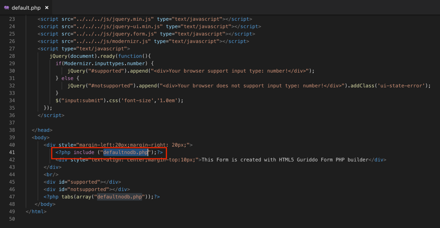
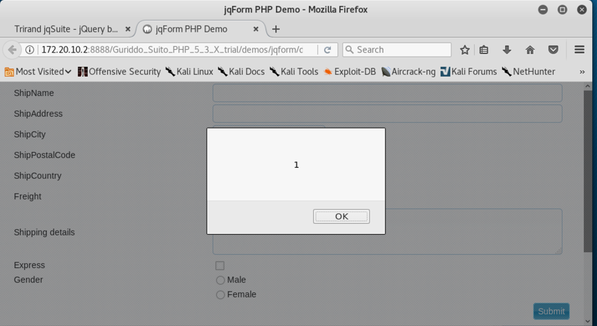
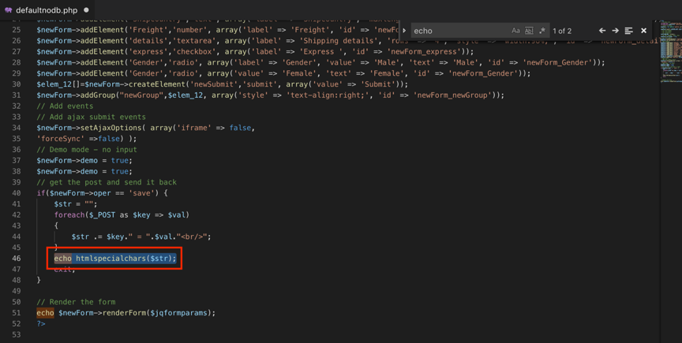
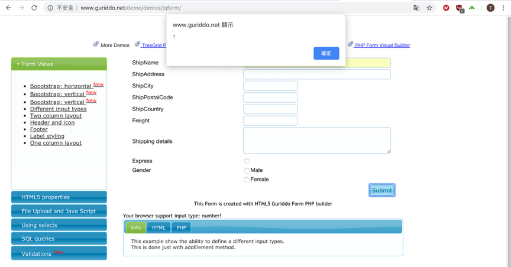

## Guriddo Form PHP XSS Vulnerability Description 
 - Author: YU-HSIANG HUANG, YUNG-HAO TSENG, Eddie TC CHANG
 - Contact: huang.yuhsiang.phone@gmail.com; 0xuhaw@gmail.com; eddietcchang@gmail.com
---
 ### Testing Target
 - Product: Guriddo Form PHP 5.3
 - Last updated：2018/2/14
 - Official Website: http://guriddo.net/?page_id=102675
 
 ### Abstract
We discovered that `/demos/jqform/defaultnodb/default.php` page the `OrderID`, `ShipName`, `ShipAddress`, `ShipCity`, `ShipPostalCode`, `ShipCountry`, `Freight` and `details` parameter has reflected XSS vulnerability

 ### Concept
1. we download the latest version from the official website and view the source code of `demos/jqform/defaultnodb/default.php`

2. From the `default.php` source we can see that it is calling `defaultnodb.php`

3. From `defaultnodb.php` we can quickly check that the code is not filtered, it can cause problems with XSS.

 4. Simply test the XSS payload, we discovered `OrderID`, `ShipName`, `ShipAddress`, `ShipCity`, `ShipPostalCode`, `ShipCountry`, `Freight` and `details` parameter has reflected XSS vulnerability.

 5. We recommend that it should add `htmlspecialchars` to solve XSS problems.
 

### Instance
1. We test from the official online demo[\[1\]](http://www.guriddo.net/demo/demos/jqform/).
 

2. It will produce the same XSS result.
 
