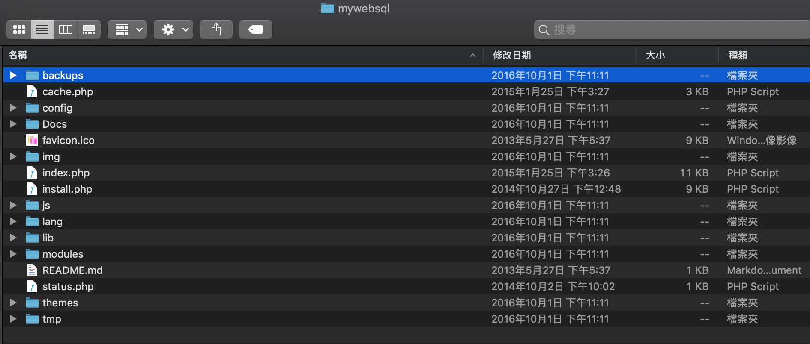
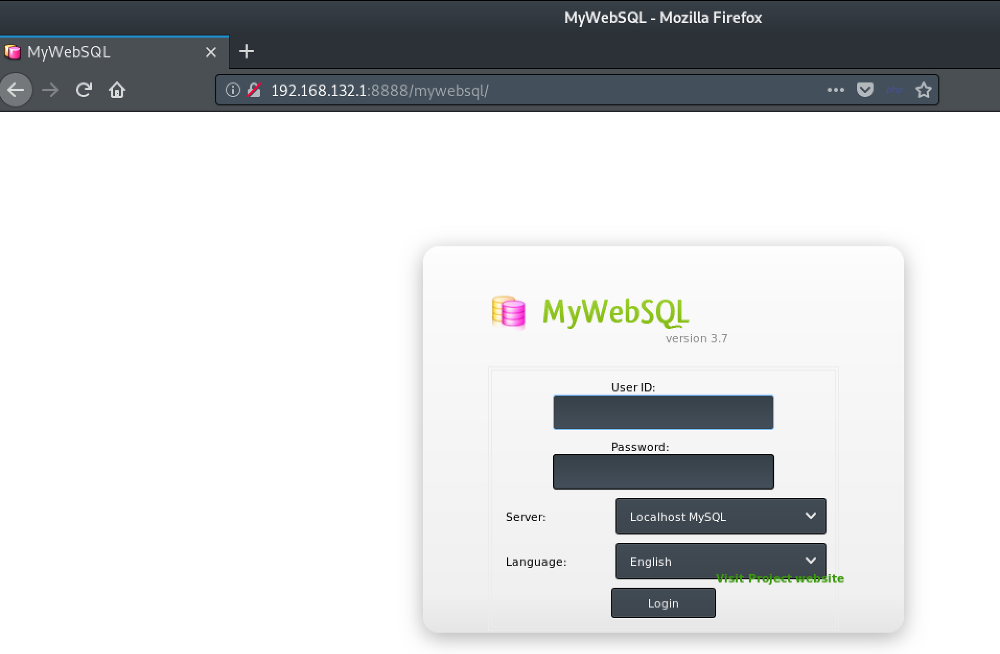
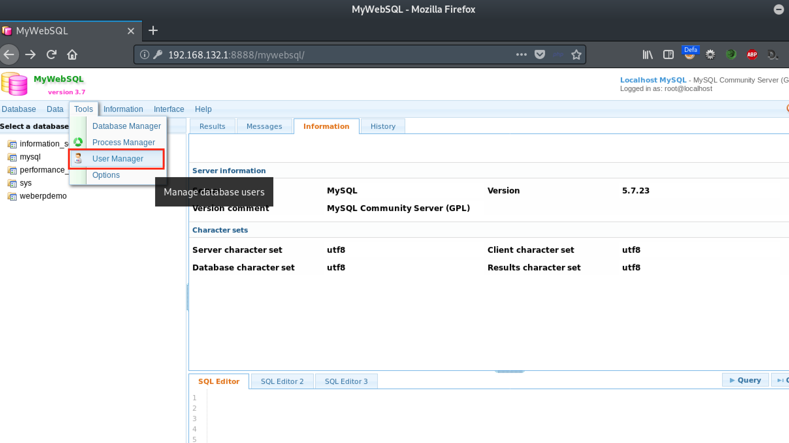
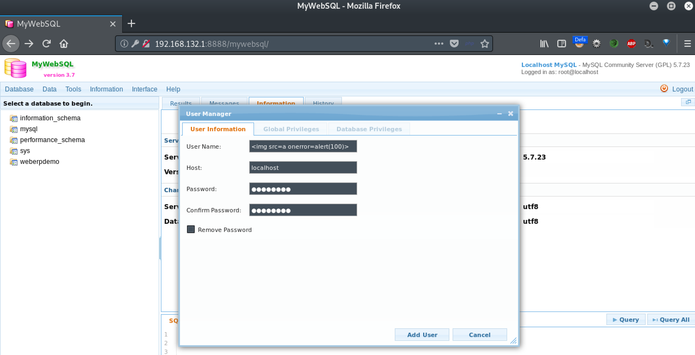
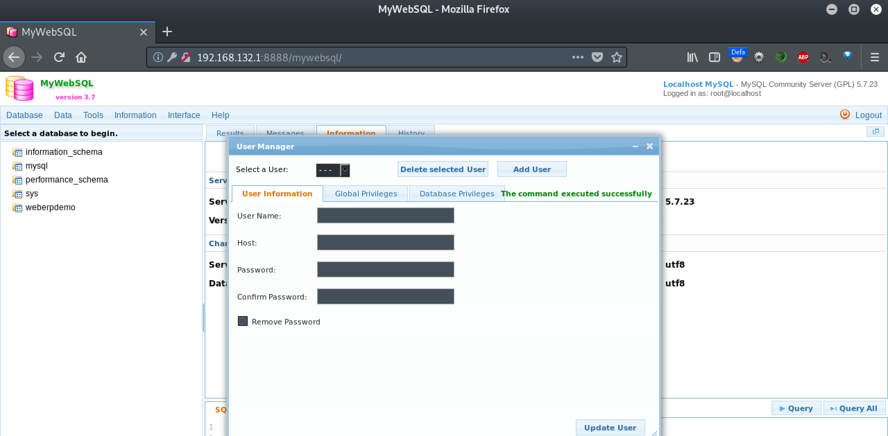
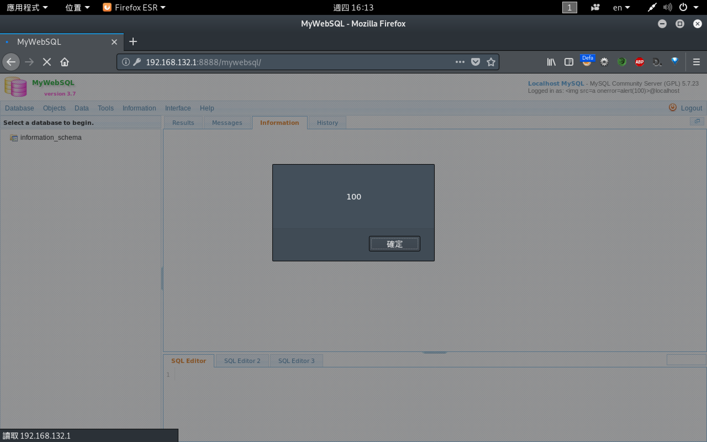

## MyWebSQL has Stored Cross-Site Scripting Vulnerability Description
 - Author: YUNG-HAO TSENG, Eddie TC CHANG, YU-HSIANG HUANG
 - Contact: 0xuhaw@gmail.com; eddietcchang@gmail.com; huang.yuhsiang.phone@gmail.com
---
 ### Testing Target
 - Product：MyWebSQL
 - Version：3.7
 - Official Website：http://mywebsql.net/
 - Affect：All Version <= 3.7
 - 
 ### Abstract
We discovered that `Add User` features the `User Name` field has Stored Cross-site Scripting (XSS) vulnerability.

 ### Concept
 1. We download the latest version from the official website and build default environment.

 2. Sign in to your own database account and click Tools -> User Manage pages.

 3. Click `Add User` Features.

4. Now we insert XSS Payload in the `User Name` field and click the `Add User` button.
- ``

5. Return to the login page and log in with payload user.

6. Great the easy payload successful execute.

