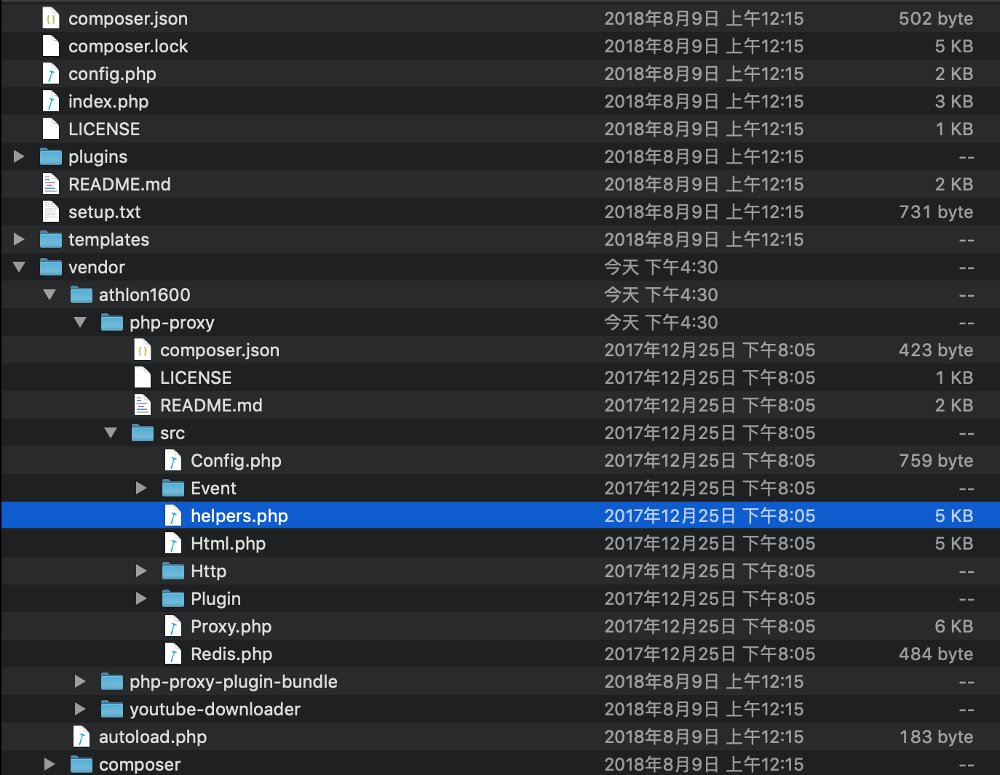
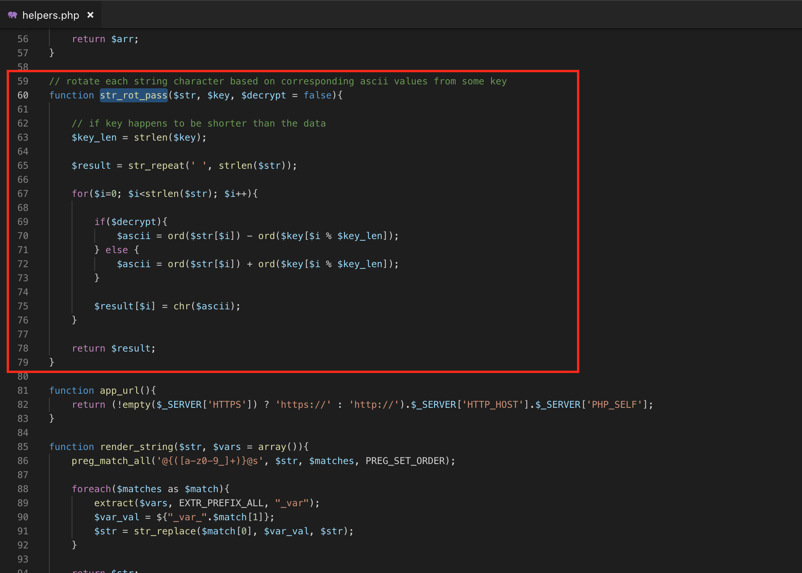
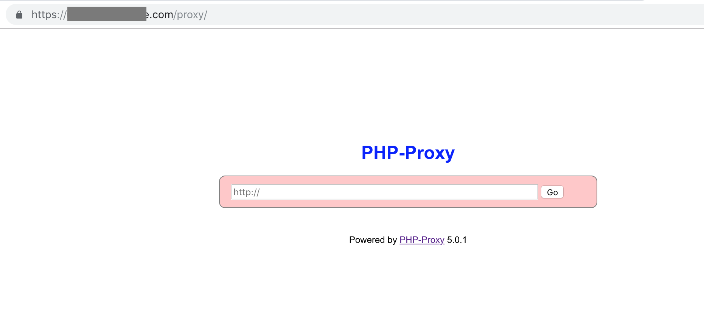
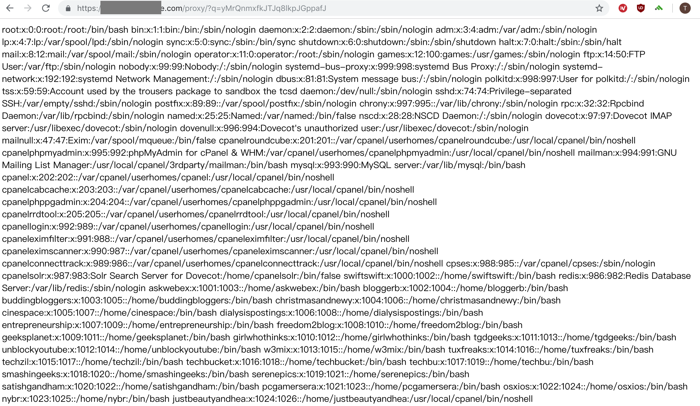

## PHP-Proxy Encrypt Key Flaw and LFI Vulnerability Description
 - Author: YU-HSIANG HUANG, YUNG-HAO TSENG, Eddie TC CHANG
 - Contact: huang.yuhsiang.phone@gmail.com; 0xuhaw@gmail.com; eddietcchang@gmail.com
---
 ### Testing Target
 - Product: PHP-Proxy
 - Version: 5.0.1
 - Affect: All Version
 - Official Website: https://www.php-proxy.com/
 - Github: https://github.com/Athlon1600/php-proxy-app

 ### Abstract
We discovered that PHP-Proxy `str_rot_pass` encrypt function  is flawed. Despite the user change the default key, the remote attacker can easily decrypt the key and cause the vulnerability of Local File Inclusion.

 ### Concept
 1. First, we download the latest version from the official website and check `helpers.php` code.

 2. From `helpers.php` code, we discovered `str_rot_pass` encrypt function is flawed. Maybe it is not rigorous enough, it is easy to be cracked.

 3. We write a sample payload that It only applies to such a condition. If you want to change the conditions, then you may need to rewrite the payload. Download Link：https://github.com/0xUhaw/CVE-Bins/blob/master/PHP-Proxy/_crack-PHP-Proxy.php
 * Mode set 2
 * Not disable curl file protocol

 ### Instance
The webERP is a very popular ERP software in Asia. This is a very serious problem, because attackers can quickly obtain sensitive information about enterprise ERP.

