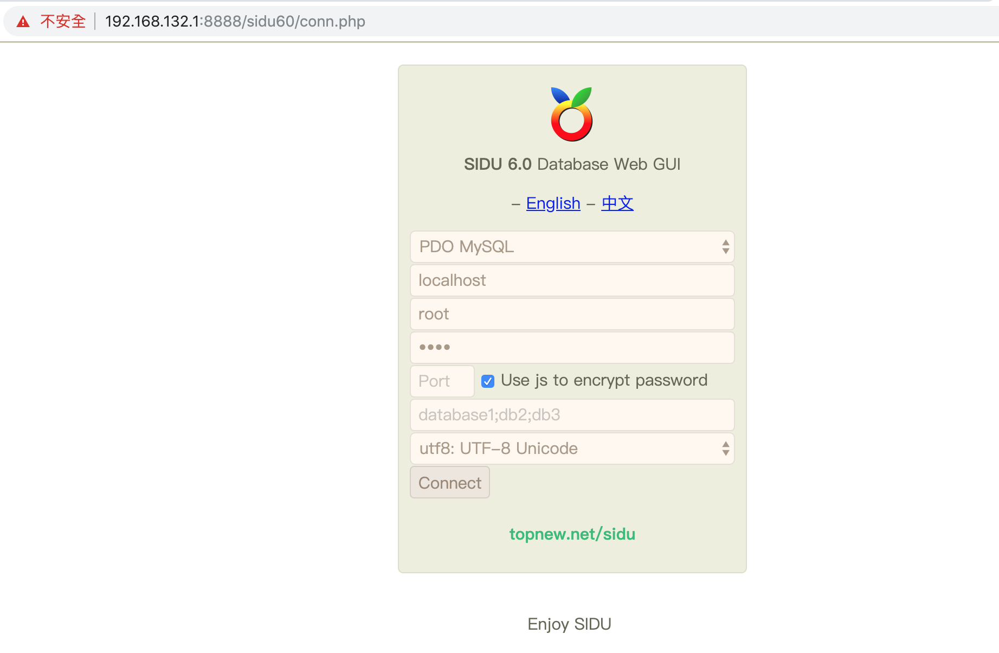
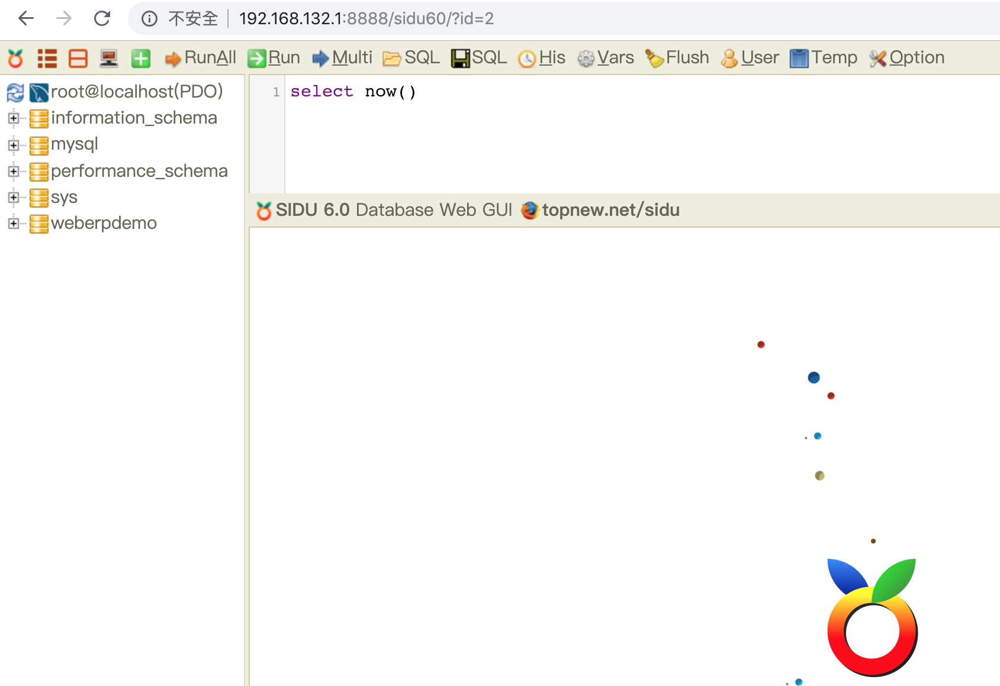
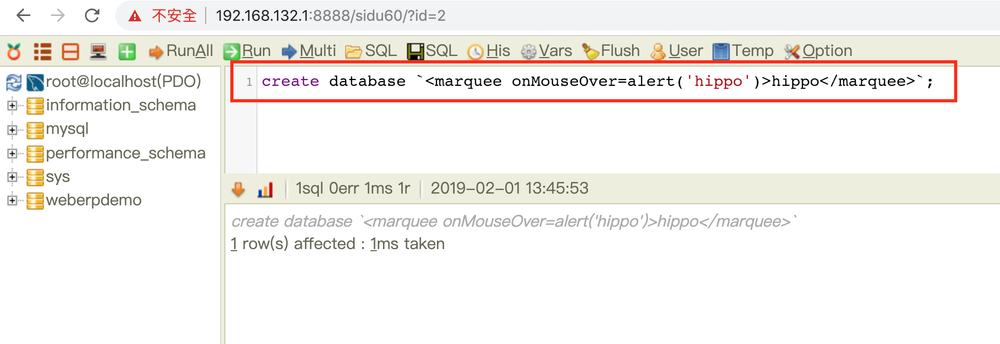
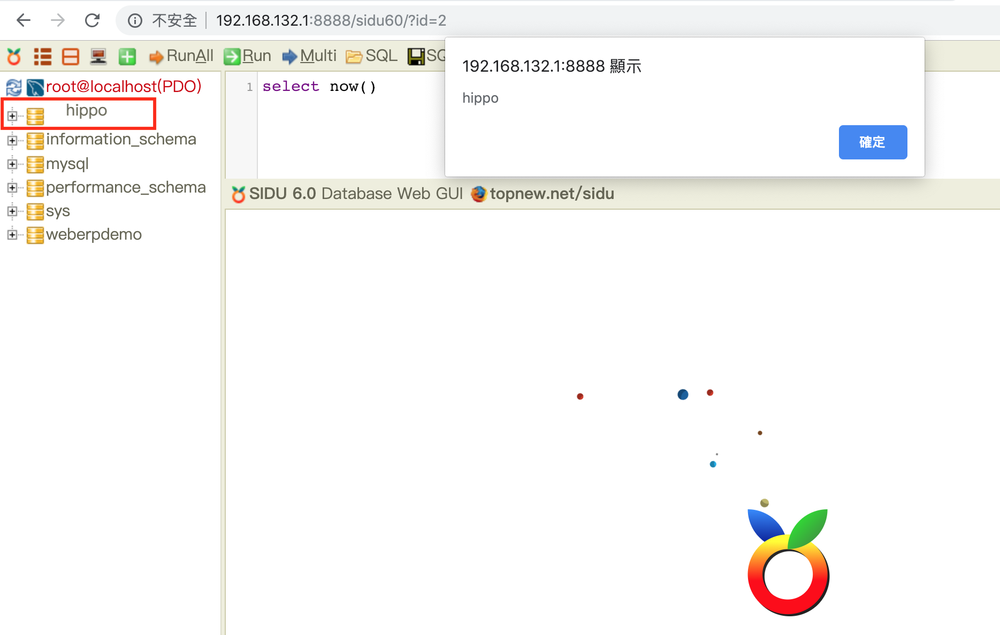

## SIDU has Stored Cross-Site Scripting (XSS) Vulnerability Description
 - Author: YUNG-HAO TSENG, Eddie TC CHANG, YU-HSIANG HUANG
 - Contact: 0xuhaw@gmail.com; eddietcchang@gmail.com; huang.yuhsiang.phone@gmail.com
---
 ### Testing Target
 - Product：SIDU
 - Version：6.0
 - Official Website：http://topnew.net/sidu
 - Affect：All Version <= 6.0
 
 ### Abstract
We discovered the `database name` is not strictly filtered, the attacker can insert the name containing XSS Payload, that cause the vulnerability of stored xss occur.

 ### Concept
 1. We download the latest version from the official website and build default environment.

 2. We use root account login database.

3. Now we create a database name with XSS payload in the SQL query field and click Run.
- payload：`create database <marquee onMouseOver=alert('hippo')>hippo</marquee>;`

4. That's funny XSS payload starts executing.

