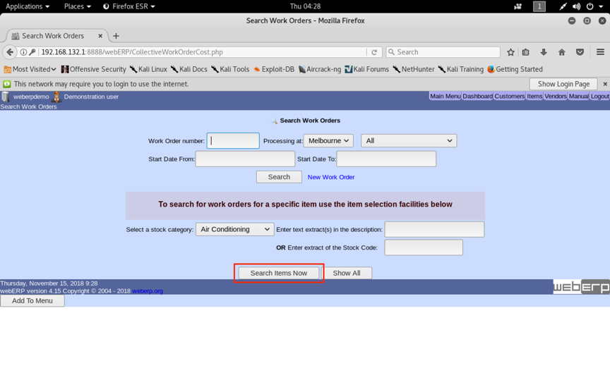
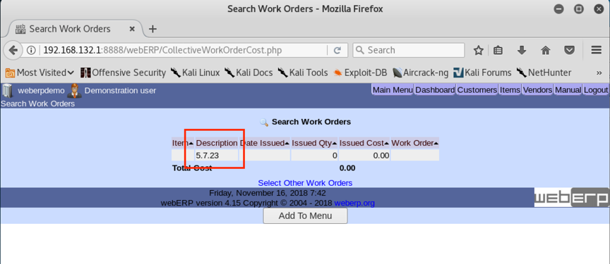

## WebERP SQL injection Vulnerability Description
 - Author: YU-HSIANG HUANG, YUNG-HAO TSENG, Eddie TC CHANG
 - Contact: huang.yuhsiang.phone@gmail.com; 0xuhaw@gmail.com; eddietcchang@gmail.com
---
 ### Testing Target
 - Product: webERP 4.15
 - Last updated: 2018/05/21
 - Official Website: http://www.weberp.org/
 - Github: https://github.com/webERP-team/webERP

 ### Abstract
The `CollectiveWorkOrderCost.php` have SQL Injection vulnerability in `SearchParts` parameter, here will be to guess the database version and user as an example.

 ### Concept
 1. First, we download the latest version from the official website and build  default demo environment. Then login with the default account password.

 2. Click `Manufacturing` -> `Multiple Work Orders Total Cost Inquiry`, we came to `CollectiveWorkOrderCost.php` pages.

 3. In this page, we click `Search Items Now` and using Burp Suite intercept packet.

4. Here we insert SQL Injection Payload after the `SearchParts` parameter.
 * Full Payload：`&Submit=&WO_1)union/**/select/**/null,@@version,null,null,null,null,(null=on`

5. That cool we successfully obtained the DB version.

 6. Try another payload and successfully get the current webERP user.

 ### Summary
The webERP is a very popular ERP software in Asia. This is a very serious problem, because attackers can quickly obtain sensitive information about enterprise ERP.
